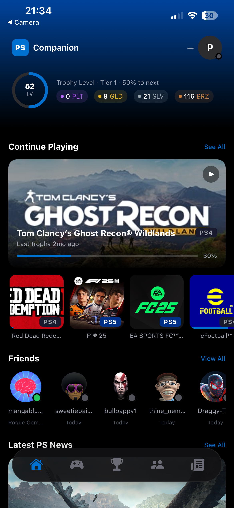
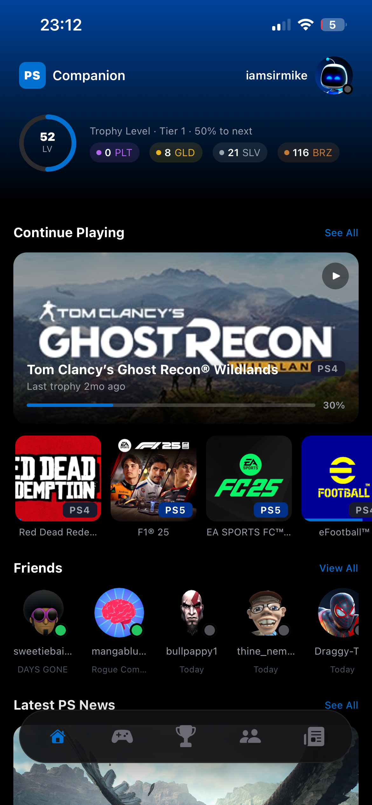
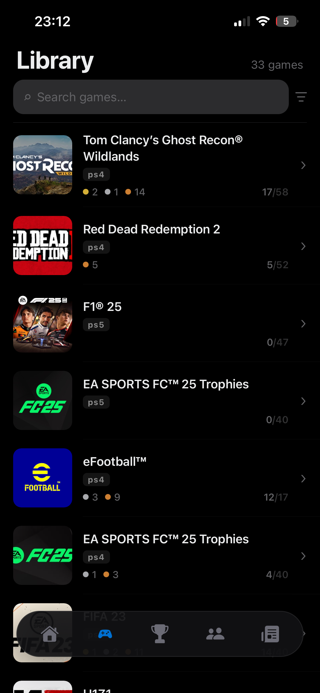
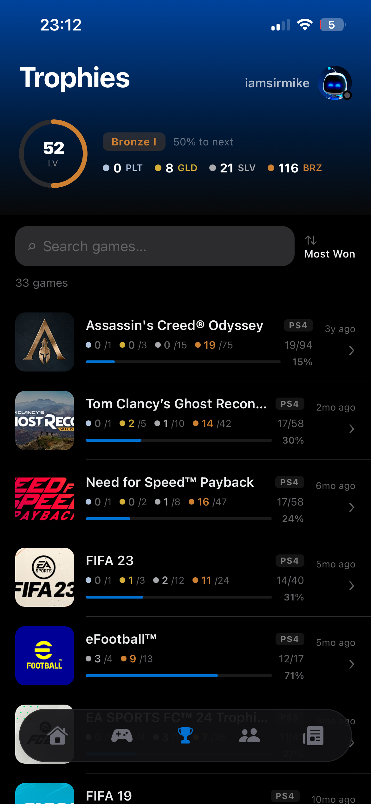
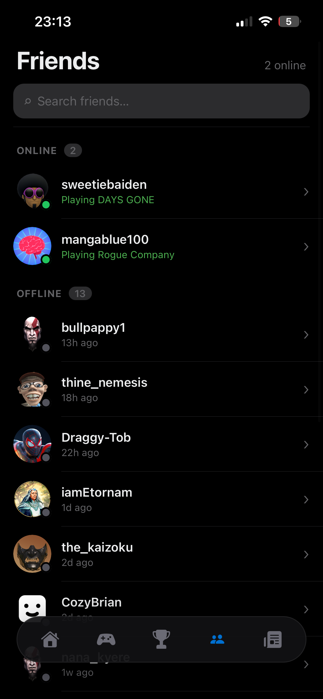
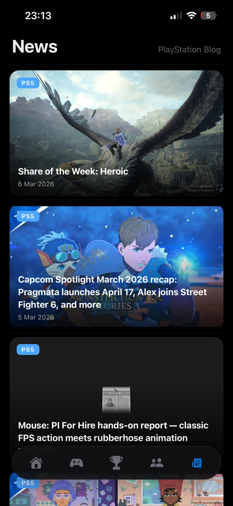

# PlayStation Companion

A React Native / Expo app that brings your PlayStation Network profile, trophy collection, library, and friends list to your phone — built entirely by vibing with AI.

> **Status:** Early access / open source. Expect rough edges.

---

## Screenshots

<table>
  <tr>
    <td align="center"><br/><sub>Welcome</sub></td>
    <td align="center"><br/><sub>Dashboard</sub></td>
    <td align="center"><br/><sub>Library</sub></td>
  </tr>
  <tr>
    <td align="center"><br/><sub>Trophy Tracker</sub></td>
    <td align="center"><br/><sub>Friends</sub></td>
    <td align="center"><br/><sub>Game Detail</sub></td>
  </tr>
</table>

---

## Features

- **Dashboard** — Hero game card, continue playing shelf, friends strip, and latest PS news
- **Library** — Full trophy-title library with search, sort (recent / A–Z / progress), and platform filter
- **Trophy Tracker** — Per-game trophy breakdown with sort and filter sheet
- **Friends** — Online status, currently playing title, and last-seen time
- **Profile** — Trophy level, tier progress, and earned trophy counts
- **PS News** — Latest PlayStation blog headlines

---

## Getting Started

### Prerequisites

- Node 18+
- Expo Go on your device **or** an iOS simulator / Android emulator
- A PlayStation Network account and your **NPSSO token**

> To get your NPSSO token: log into [PlayStation.com](https://www.playstation.com) in a browser, then visit `https://ca.account.sony.com/api/v1/ssocookie`. Copy the `npsso` value.

### Install & run

```bash
npm install
npx expo start
```

Scan the QR code with Expo Go, or press `i` / `a` to open in a simulator.

---

## Contributing

Contributions are welcome — and the process is deliberately low-friction.

### The vibe

This project is **100% vibe coded**. That means:

- Open your AI assistant of choice (GitHub Copilot, Cursor, Claude, ChatGPT — whatever you vibe with)
- Describe what you want to build or fix in plain English
- Let it generate the code
- Test it, tweak it, ship it

There are no strict style rules, no mandatory PR templates, no design committee. If it works and it looks good, it's welcome.

### How to contribute

1. Fork the repo and create a branch (`git checkout -b feat/my-cool-thing`)
2. Make your changes — vibe away
3. Make sure the app runs without errors (`npx expo start`)
4. Open a pull request with a short description of what you changed and why

### Guidelines (loose)

- Keep the dark PlayStation aesthetic — navy, deep blue, dark backgrounds
- Prefer `StyleSheet` over NativeWind for complex components
- New screens go in `app/`, reusable UI in `components/`, data hooks in `features/<name>/`
- Don't break the existing auth or navigation flow

---

## Feature Requests

Got an idea? [Open an issue](../../issues/new) with the label `feature request`.

Good candidates:

- New dashboard widgets (trophy milestones, comparison with friends, etc.)
- Trophy rarity display per game
- Push notifications for friends coming online
- PS Store wishlist / price tracking
- Widget / home screen support

Not in scope (PSN API limitation):

- Real-time game installs / download queue — Sony doesn't expose this via any public API

---

## Architecture

> Full details in [ARCHITECTURE.md](ARCHITECTURE.md).

### Folder structure

```
app/                  Expo Router screens (thin route shells only)
  (tabs)/             Five-tab bottom navigator
  game/[titleId].tsx  Game detail route
  friend/[accountId]  Friend profile route
  welcome.tsx         Unauthenticated landing screen
  auth.tsx            NPSSO sign-in screen

features/             All domain logic, co-located by feature
  dashboard/
  library/
  trophies/
  friends/
  news/
  game-detail/

services/             Pure async functions — no React, fully testable
  psn-auth.ts
  psn-games.ts
  psn-trophies.ts
  psn-friends.ts

context/              Lean React contexts (auth state + user profile)
  auth-context.tsx
  user-context.tsx

components/           Shared, feature-agnostic UI primitives
types/psn.ts          Shared TypeScript types for all PSN data shapes
```

### State model

| Concern | Tool |
|---|---|
| Auth tokens | `expo-secure-store` (Keychain / Keystore) |
| User profile in-session | React Context (`UserContext`) |
| All PSN/API data | TanStack Query v5 — caching, background refetch, stale-while-revalidate |
| Offline cache | `AsyncStoragePersister` — last-fetched data survives restarts |

### Data flow (example — Library tab)

```
app/(tabs)/library.tsx
  └─ LibraryScreen
       └─ useLibrary()  →  TanStack Query  →  services/psn-games.ts  →  psn-api  →  PSN
                        ←  AsyncStorage cache shown immediately (stale)
                        ←  fresh response replaces cache in background
```

### Auth flow

```
Cold start → read expo-secure-store
  token valid          → (tabs)
  token expired        → silent refresh → (tabs)
  no token / expired   → /welcome → /auth → paste NPSSO → (tabs)
```

---


| Layer | Library |
|---|---|
| Framework | Expo SDK 54 + Expo Router v6 |
| Language | TypeScript |
| Data fetching | TanStack Query v5 |
| PSN data | psn-api |
| Animations | Reanimated 3 |
| Gradients | expo-linear-gradient |
| Images | expo-image |

---

## License

MIT — do whatever you want with it.
